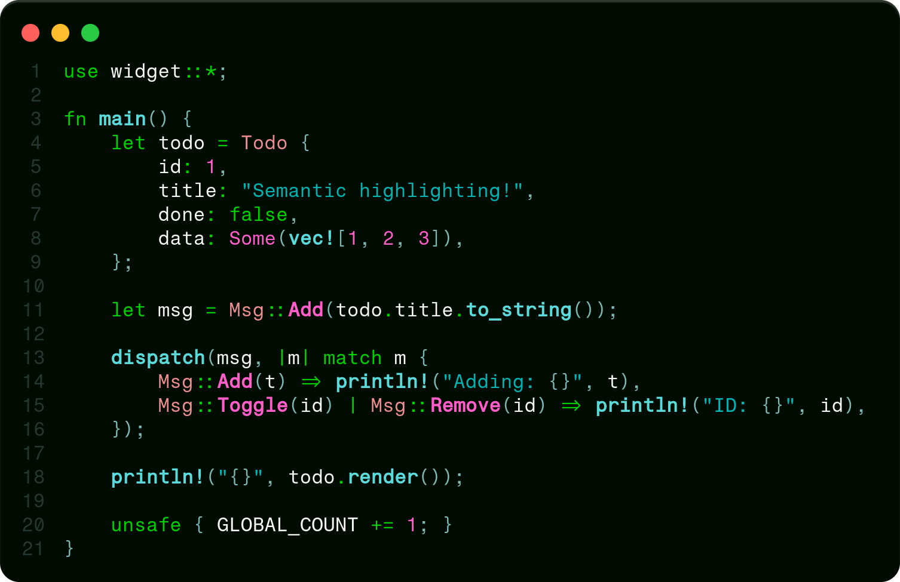
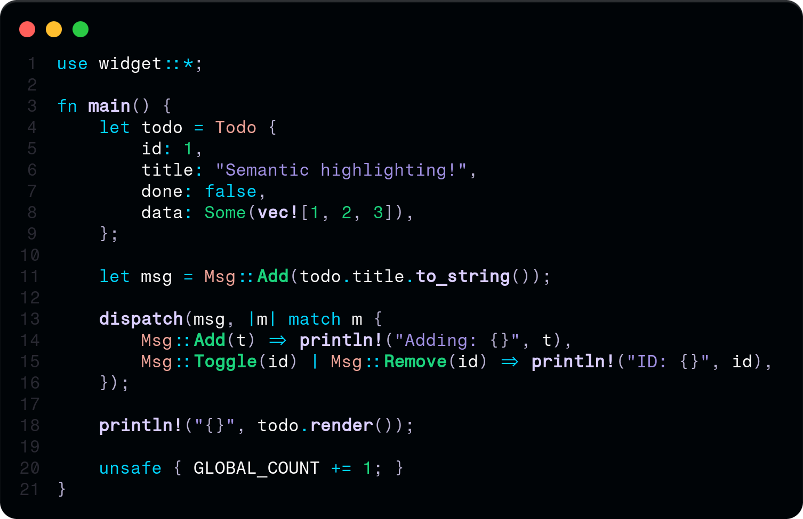
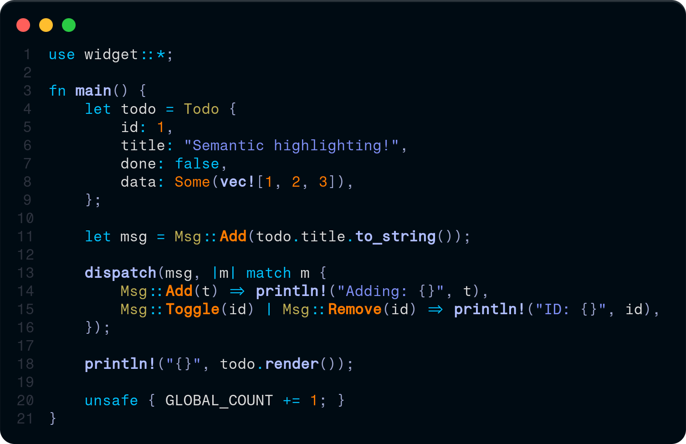
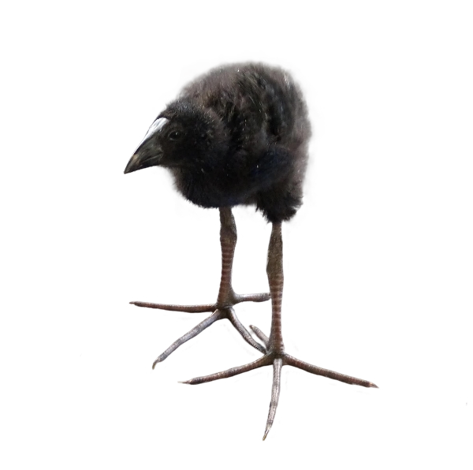

# Evoke

Evoke is an experimental collection of parametric dark themes.
All variants are derived from the **BASE** variant.

> Highlighting elements logically produces intuitive aesthetics matching stylistic traits using contrasts knowingly. Integration naturally tunes hues emphasizing balance resulting outstanding overlays making code layers organized, smoothly elevating themes.

## Variants Preview

### Evoke BASE

### Evoke LAVENDER

### Evoke ICE

### Evoke BLACKLIGHT

---

